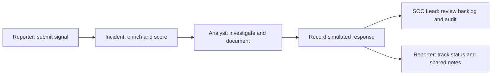

# Lighthouse SOC

[](https://github.com/richfish85/lighthouse-soc/actions/workflows/tests.yml)

**A guided SOC training platform for practising evidence-led triage, investigation, response, and analyst handover.**

Lighthouse SOC is built around one question: can a junior analyst turn an incoming signal into a clear, evidence-led next action? The training lab offers six guided investigations, evidence records, decision feedback, a working notebook, and downloadable practice reports. The original Streamlit incident simulator retains SQLite persistence, role-based screens, and a tested incident lifecycle.

## Browser Incident Simulator

Open [Incident Simulator](https://lighthouse-soc.vercel.app/simulation), or choose **Incident Simulator** beneath **Field guide** in the training sidebar. The existing guided training, skills, profile, and progress remain available.

### Implementation

The browser simulator restores the original role workflow using the repository's six sample alerts, asset and identity records, IP reputation fixtures, and response playbooks (deployment copies checked against the originals by tests). Reporter intake creates and enriches an incident; analysts filter the queue, inspect evidence and scoring, assign themselves, check playbook steps, save internal or reporter-visible notes, and record escalation, containment, closure, or false positives. SOC Lead provides backlog, priority, assignment, status counts, incident oversight, and audit history.



### Walkthrough and validation

1. Select **Reporter** and submit a fictional signal (for example, identity `olivia.chen`, asset `FIN-WS-01`, IP `203.0.113.19`).
2. Switch to **Analyst** and open the newly assigned incident ID in the queue.
3. Inspect enrichment and the additive P1–P5 explanation; assign the incident and practise the response playbook.
4. Save an evidence-based note, optionally share it with the reporter, then record a response.
5. Switch to **SOC Lead** to review the updated backlog and incident audit. Return to Reporter to see the shared update.
6. Reload to resume. **Reset simulation** restores the six fixtures after confirmation and preserves guided training/profile data.

Automated UI tests cover this complete role-switching flow, reload, reset isolation, internal-note visibility, invalid saved data, and unavailable storage. Scoring follows `app/services/scoring.py`; priorities are recalculated instead of trusting fixture labels (INC-2006's inputs total 8, so it displays P3).

### Assumptions and risk notes

This is a single-browser practice environment, not a shared incident service. Simulation state uses a separate `lighthouse-simulation-v1` local-storage key. Role switching is not authentication or a security boundary. Enrichment is synthetic; unknown indicators remain unknown. Original attachment names are references, not downloadable evidence files. Containment and other response actions only update fictional records. No live systems are contacted. Use fictional information only. The original Python/SQLite application remains available below for its server-side role checks and database workflow.

## Training platform · v0.3

**[Visit Lighthouse](https://lighthouse-soc.vercel.app)** — hosted on Vercel's free Hobby plan. Start as a guest; progress stays on your device.

The previous [Sites demo](https://lighthouse-soc-training.richfish85245111.chatgpt.site) remains a separate older version. Browser-local records do not automatically transfer between domains.

- Six cases covering phishing, identity, endpoint activity, data exposure, detection tuning, and incident handover.
- A public landing page and SOC orientation pathway, with immediate guest access.
- Analyst Skills: 23 capabilities linked to case decisions and honest practice evidence.
- Briefing → evidence room → three decisions → explained debrief.
- Editable handover templates, browser-local progress, retry support, and Markdown practice reports.
- Optional device-local profile; no online sign-in or cross-device sync.
- The same curriculum is available in the local Streamlit Training Lab.
- Written handovers use an example and self-review checklist; only decisions are automatically scored.

Read the [training walkthrough](docs/TRAINING_WALKTHROUGH.md) or [web app setup](training/README.md). No certification or professional-experience claim is attached to practice scores.

> This is a learning simulator, not a production SIEM and not a claim of commercial SOC experience. All people, organisations, events, hostnames, and IP addresses are fictional or reserved for documentation.

## What

The MVP models a simple path:

```text
Reporter submits signal
        -> incident is opened and enriched
        -> analyst triages, investigates, and documents
        -> responder escalates, contains, closes, or records a false positive
        -> SOC lead reviews backlog and operational metrics
```

### Roles

| Role | Main view | Can demonstrate |
| --- | --- | --- |
| Reporter | Reporter Portal | Submit suspicious activity and track submitted alerts |
| Analyst / Responder | Analyst Console | Review evidence, assign priority, use playbooks, write notes, escalate, and close |
| Admin / SOC Lead | Admin Console | Review incidents, backlog health, trends, and team-level metrics |

## Why

The project makes entry-level SOC habits visible:

- establish scope before deciding impact
- separate evidence from assumptions and open questions
- use severity, confidence, asset criticality, and privilege consistently
- document false positives as carefully as suspicious cases
- leave a concise handover another responder can continue from

## How

The current implementation uses:

| Area | Choice |
| --- | --- |
| UI | Streamlit |
| Language | Python |
| Persistence | SQLite |
| Demo context | JSON seed files |
| Validation | Pytest, CLI smoke workflow, GitHub Actions |
| Diagrams | Mermaid |

The code is organised around reusable services rather than putting triage logic inside the UI. See [ARCHITECTURE.md](ARCHITECTURE.md) for the data flow and design trade-offs.

## Original incident simulator scope

- role-based demo login for Reporter, Analyst, and Admin
- reporter intake and alert tracking
- automatic incident creation, enrichment, and transparent P1-P5 scoring
- analyst queue, investigation view, playbook guidance, notes, escalation, containment, closure, and false-positive handling
- admin dashboard and incident oversight
- SQLite schema, deterministic seed data, CLI bootstrap, and audit records
- synthetic analyst casebook and KQL lab queries for investigation practice

## Run locally

```powershell
python -m venv .venv
.\\.venv\\Scripts\\Activate.ps1
python -m pip install -r requirements.txt
python -m app.cli seed --reset
streamlit run app/main.py
```

Useful checks:

```powershell
python -m app.cli smoke
python -m pytest
```

The application opens in **Training Lab**. Choose **Incident Simulator** in the sidebar for the original workflow. Demo accounts are seeded as `reporter01`, `analyst01`, and `admin01`.

## Walkthrough material

- [Analyst casebook](docs/ANALYST_CASEBOOK.md): four completed synthetic investigations
- [KQL lab queries](docs/kql/soc_triage_queries.kql): example investigation queries with schema caveats
- [Architecture diagrams](diagrams/): architecture, RBAC, incident lifecycle, and screen flow
- [Threat model](THREAT_MODEL.md): current trust boundaries and deferred controls
- [Roadmap](ROADMAP.md): what is complete, next, and deliberately deferred


## Design boundaries

The MVP favours portability and explainability over production infrastructure:

- SQLite keeps the demo easy to run and inspect.
- Rule-based scoring keeps priority decisions reviewable.
- Seeded login is suitable for a local demo; real authentication is future work.
- External enrichment is represented by synthetic JSON context; no live customer or production data is used.
- The React/Vite web platform is independently deployable from `training/` as static assets on Vercel. It does not expose the local incident database or seeded logins.

## Screenshots

### Login gateway


### Analyst queue


### Investigation view


### Admin dashboard


## License

MIT. See [LICENSE](LICENSE).

## Author

Richard Fisher · [github.com/richfish85](https://github.com/richfish85)
