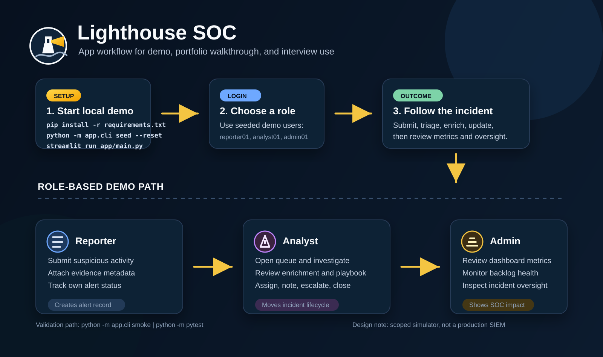

# Lighthouse SOC

[](https://github.com/richfish85/lighthouse-soc/actions/workflows/tests.yml)

**A local, synthetic SOC lab for practising alert triage, investigation, escalation, and analyst handover.**

Lighthouse SOC is a portfolio project built around one question: can a junior analyst turn an incoming signal into a clear, evidence-led next action? It is a deliberately small Streamlit application with SQLite persistence, seeded cases, explainable scoring, role-based screens, and a tested incident lifecycle.

> This is a learning simulator, not a production SIEM and not a claim of commercial SOC experience. All people, organisations, events, hostnames, and IP addresses are fictional or reserved for documentation.

## What

The MVP models a simple path:

```text
Reporter submits signal
        -> incident is opened and enriched
        -> analyst triages, investigates, and documents
        -> responder escalates, contains, closes, or records a false positive
        -> SOC lead reviews backlog and operational metrics
```

### Roles

| Role | Main view | Can demonstrate |
| --- | --- | --- |
| Reporter | Reporter Portal | Submit suspicious activity and track submitted alerts |
| Analyst / Responder | Analyst Console | Review evidence, assign priority, use playbooks, write notes, escalate, and close |
| Admin / SOC Lead | Admin Console | Review incidents, backlog health, trends, and team-level metrics |

## Why

The project makes entry-level SOC habits visible:

- establish scope before deciding impact
- separate evidence from assumptions and open questions
- use severity, confidence, asset criticality, and privilege consistently
- document false positives as carefully as suspicious cases
- leave a concise handover another responder can continue from

## How

The current implementation uses:

| Area | Choice |
| --- | --- |
| UI | Streamlit |
| Language | Python |
| Persistence | SQLite |
| Demo context | JSON seed files |
| Validation | Pytest, CLI smoke workflow, GitHub Actions |
| Diagrams | Mermaid |

The code is organised around reusable services rather than putting triage logic inside the UI. See [ARCHITECTURE.md](ARCHITECTURE.md) for the data flow and design trade-offs.

## Current v0.1 scope

- role-based demo login for Reporter, Analyst, and Admin
- reporter intake and alert tracking
- automatic incident creation, enrichment, and transparent P1-P5 scoring
- analyst queue, investigation view, playbook guidance, notes, escalation, containment, closure, and false-positive handling
- admin dashboard and incident oversight
- SQLite schema, deterministic seed data, CLI bootstrap, and audit records
- synthetic analyst casebook and KQL lab queries for investigation practice

## Run locally

```powershell
python -m venv .venv
.\\.venv\\Scripts\\Activate.ps1
python -m pip install -r requirements.txt
python -m app.cli seed --reset
streamlit run app/main.py
```

Useful checks:

```powershell
python -m app.cli smoke
python -m pytest
```

Demo accounts are seeded as `reporter01`, `analyst01`, and `admin01`.

## Walkthrough material

- [Analyst casebook](docs/ANALYST_CASEBOOK.md): four completed synthetic investigations
- [KQL lab queries](docs/kql/soc_triage_queries.kql): example investigation queries with schema caveats
- [Architecture diagrams](diagrams/): architecture, RBAC, incident lifecycle, and screen flow
- [Threat model](THREAT_MODEL.md): current trust boundaries and deferred controls
- [Roadmap](ROADMAP.md): what is complete, next, and deliberately deferred



## Design boundaries

The MVP favours portability and explainability over production infrastructure:

- SQLite keeps the demo easy to run and inspect.
- Rule-based scoring keeps priority decisions reviewable.
- Seeded login is suitable for a local demo; real authentication is future work.
- External enrichment is represented by synthetic JSON context; no live customer or production data is used.
- Streamlit is the current prototype surface; a separate API and richer frontend are later options, not current scope.

## Screenshots

### Login gateway


### Analyst queue


### Investigation view


### Admin dashboard


## License

MIT. See [LICENSE](LICENSE).

## Author

Richard Fisher · [github.com/richfish85](https://github.com/richfish85)
