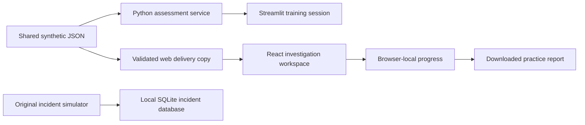

# Lighthouse SOC training walkthrough

## What

A roughly 105-minute beginner-to-intermediate path with six cases. The public web lab and local Streamlit Training Lab share the same synthetic case dataset and assessment rubric.

| Case | Focus | Minutes | Evidence-based decision |
| --- | --- | ---: | --- |
| LH-101 | Email security | 12 | Phishing evidence versus established credential exposure |
| LH-102 | Identity | 15 | Correlating impossible travel with approved VPN activity |
| LH-201 | Endpoint | 18 | Execution versus prevention; proportionate isolation |
| LH-202 | Data access | 20 | Exposure versus confirmed external disclosure |
| LH-203 | Detection tuning | 15 | Explaining scanner noise without broad suppression |
| LH-301 | Handover capstone | 25 | Sensitive-account compromise, priority, state, and ownership |

## Why

The lab rewards a defensible next action. Learners must distinguish observed facts, hypotheses, missing evidence, and actions that have actually happened. Both benign and malicious scenarios matter.

## How: first case

1. Open the Training Lab and start **The invoice that almost worked**.
2. Read the briefing and the short authentication lesson.
3. Inspect E1, E2, and E3. The SPF result, mismatched login destination, and visibility limit answer different questions.
4. Record facts with evidence IDs, the reviewed scope and time, open questions, and an authorised next action in the notebook.
5. Select an answer to each of the three decisions. A short handover of at least 40 characters is required; this is a completeness check, not a writing-quality score.
6. Submit. Review the explanation for each decision, including correct answers.
7. Compare your own handover with the example. Retry decisions if needed.
8. In the web app, open My progress and download the Markdown practice report. In Streamlit, download the session record before leaving.

## Handover self-review

- [ ] Affected identity or asset and UTC timeline are clear.
- [ ] Claims cite evidence and separate facts from assumptions.
- [ ] Visibility gaps are stated explicitly.
- [ ] Completed and proposed actions are distinct.
- [ ] The next action has an owner and a reason.
- [ ] The priority follows the case rubric; no impact is invented.

## Implementation

The training paths do not mutate the incident database. Streamlit preserves the Reporter, Analyst, and Admin workflows under **Incident Simulator**.

## Assumptions

This is self-paced practice for an individual learner. There is no instructor account, cohort management, verified exam, real telemetry ingestion, or commercial training accreditation. The capstone's P1–P3 rubric is explicitly exercise-specific.

## Threat and risk notes

Use fictional data only. Browser-local notes are accessible to anyone using the same browser profile and origin; they are not encrypted private storage. The answer key is public. No action in these cases executes containment against a real system. Keep the original seeded-login simulator local; it is not production authentication.

## Validation steps

Run the Python suite and incident smoke test from the repository root. Run the web unit/component tests, type check, lint, build, and dependency audit from `training/`. The curriculum parity test catches mismatches between the two delivery paths. A real-browser visual/accessibility review and native WebMCP validation are separate remaining checks.
